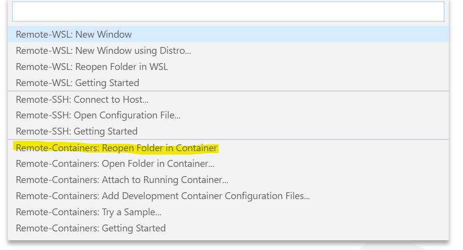

# Python intro Workshop

A very quick introduction to the Python programming language through doing exercises.

## Prerequisites

 - [VS Code](https://code.visualstudio.com/)
 - [Docker](https://hub.docker.com/)

## Setting up the environment

Instead of using the time on the workshop to install python on the computer. We will use 
the VSCode Remote Development extension.

You can find the extension by searching after `Remote Development` in the extension tab. 
Or by using the extension id `ms-vscode-remote.vscode-remote-extensionpack` directly.

So as long as you have the prerequisites installed, we should be in the batters box and ready to go! Clone this repo `git clone https://github.com/ETroll/python-intro-workshop.git`, point VSCode to the cloned directory and click the green button in the lower left hand corner and choose: `Remote-Containers: Reopen folder in container`

### Green button on lower left corner

### Menu opened after (Choose `Remote-Containers: Reopen folder in container` here)

More information about development containers / remote containers can be found here: [Developing inside a Container](https://code.visualstudio.com/docs/remote/containers)

## Documentation

There are a plethora of tutorials and articles on how to get started writing Python on the internet. It is highly recommended that you read one or more of those. Remember: [Stackoverflow](https://stackoverflow.com/questions/tagged/python) is your friend! (And collective memory?)

For this workshop I have created a small cheat sheet with previous C# or Java knowledge in mind. Hopefully it can be of some help to get started and at least help you with knowing what to google for.

[Python for Java / C# Developers - Cheat sheet](Python-for-developers-cheat-sheet.md)

## Exercises

I am a firm believer in _Learning by Doing_, so this workshop does not have any presentation at all. No slides! It is all about doing small exercises.

1. FizzBuzz - Write the "classic" FizzBuzz using Python. Create a function that takes a number.
   - If the number is divisible by 3 - Return "Fizz"
   - If it is divisible by 5 - Return "Buzz"
   - If it is divisible by both 3 and 5 - Return "FizzBuzz"
   - Otherwise - Return the number

   Congrats! You solved the FizzBuzz "problem" using Python, you can now officially interview as a Python programmer ;)

   - Bonus: Write a loop that does FizzBuzz for the numbers 1 to 20

2. Write a program that asks the user for a sentence containing multiple words. Print back the sentence with the words outputted in reversed order. So the sentence: "`Hi! I am learning Python right now.`" Gets outputted: "`now. right Python learning am I Hi!`"
   - Bonus: Do the same but read the sentence from the file named `sentence.txt` in the `exampledata/` folder.

3. Create a "Rock-Paper-Scissors" game. The game will start with displaying the player a numbered choice of `rock`, `paper` and `scissors`. The player will choose one of the options by entering a number representing the choice. The computer will then choose a hand by random and compare it against the players hand. Who will be the winner? The game will continue on a loop until the player chooses to exit the game. Remember the rules of the game:
    - Rock beats scissors
    - Scissors beats paper
    - Paper beats rock

4. Create a function that calculates the Scrabble value of a word given as a parameter. A file names `exampledata/scrabbleletters.json` contains a list of all words and their values to use in the calculations. Tip: There exists a built-in Python module called `json` that is _not_ described in the cheat sheet. Look up its documentation on [docs.python.org](docs.python.org).